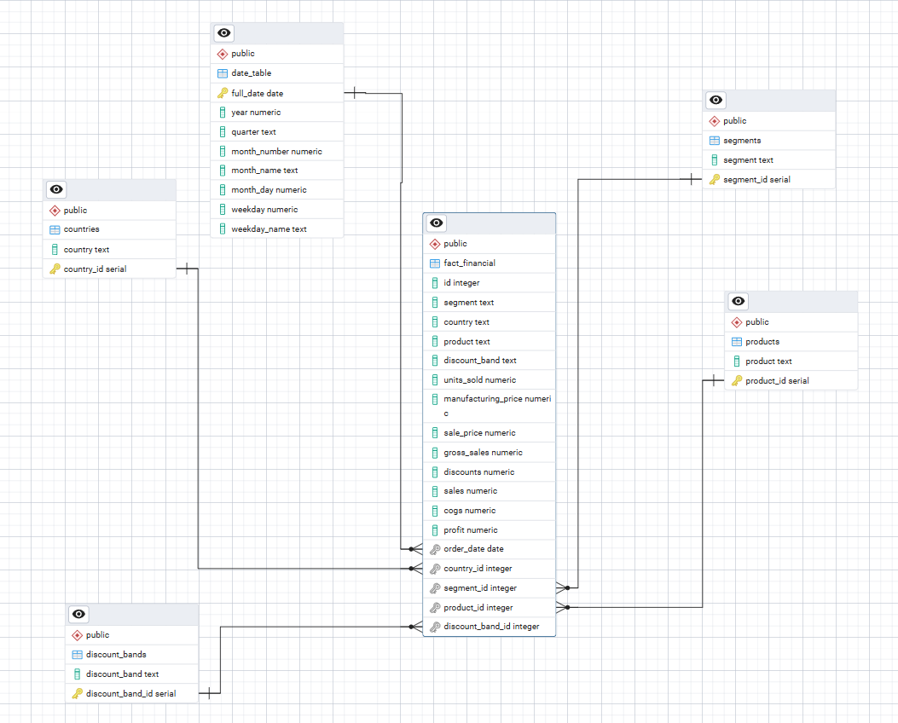

# Building a Star Schema Data Warehouse in PostgreSQL

## 📌 Overview

This project demonstrates the end-to-end process of transforming raw financial data into a structured **star schema data warehouse** using PostgreSQL, followed by performing **advanced analytical queries (EDA)** to extract business insights.

The goal of this project is to showcase both **data engineering** and **data analytics** skills by:

* Designing a data model suitable for analytics
* Cleaning and transforming raw data
* Building fact and dimension tables
* Writing advanced SQL queries for business insights

---

## 🎯 Project Objectives

* Convert raw CSV data into a structured database
* Design and implement a **star schema**
* Perform **data cleaning and transformation within SQL**
* Execute **advanced analytical queries** using SQL
* Generate insights relevant to business decision-making

---

## 🛠️ Tech Stack

* PostgreSQL
* pgAdmin
* psql (CLI tool)

---

## 📂 Project Structure

```
postgres-star-schema-project/
│
├── data/
│   └── Financial_Sample.csv
│
├── sql/
│   ├── dim_table_formation.sql
│   ├── fact_table_formation.sql
│   └── eda.sql
│
├── images/
│   ├── schema.png
│   ├── query_1.png
│   ├── query_2.png
│   └── ...
│
└── README.md
```

---

## 🏗️ Data Pipeline & Implementation

### 1️⃣ Raw Table Creation (pgAdmin)

The initial table structure was manually created in **pgAdmin** to prepare for data ingestion.

* Defined all columns based on the CSV structure
* Used flexible data types initially (e.g., TEXT) to allow smooth ingestion

---

### 2️⃣ Data Ingestion (psql CLI)

Data was imported using the PostgreSQL CLI tool with the `\\copy` command:

```sql
\copy financial_data (segment, country, product, discount_band, units_sold, manufacturing_price, sale_price, gross_sales, discounts, sales, cogs, profit, order_date, month_number, month_name, year)
FROM 'path/to/file.csv'
DELIMITER ',' CSV HEADER;
```

---

### 3️⃣ Dimension Table Creation

Dimension tables were created by extracting **unique values** from the raw dataset.

Key steps:

* Used `SELECT DISTINCT` to identify unique attributes
* Created separate dimension tables
* Added **primary keys** for each dimension

The dimensions are:

* `dim_segment`
* `dim_country`
* `dim_product`
* `dim_discount_band`
* `dim_date`

---

### 4️⃣ Fact Table Creation (Core of the Project)

The fact table was built through a **step-by-step transformation process**, combining cleaning and modeling.

#### Data Cleaning Performed:

* Removed currency symbols (e.g., `$`)
* Converted TEXT fields to NUMERIC
* Handled missing/empty values
* Ensured consistency across columns

#### Data Modeling Steps:

* Joined raw data with each dimension table
* Replaced descriptive fields with foreign keys
* Ensured referential integrity

#### Final Output:

* A centralized **fact table** with:

  * Measures: sales, profit, cogs, etc.
  * Foreign keys linking to all dimensions

---

## ⭐ Star Schema Design

Below is the star schema used in this project:



This design improves:

* Query performance
* Analytical flexibility
* Data organization

---

## 📊 Exploratory Data Analysis (EDA)

Advanced SQL queries were written to extract insights from the data warehouse.

### 🔍 Key Analysis Areas

#### 🟢 Business Performance

* Total sales by country
* Sales by product
* Sales by segment

#### 🟡 Profitability Analysis

* Profit margin by segment
* Least profitable segments
* Discount impact on profitability

#### 🔴 Time-Based Analysis

* Monthly sales trends
* Yearly performance comparison

#### 🔥 Advanced SQL Techniques

* Ranking using window functions
* Running totals
* Contribution percentage analysis
* Year-over-year growth (LAG function)

---

## 📸 Sample Queries

### Top Performing Countries


### Running Total Analysis


---

## 💡 Key Insights

* Some segments generate high revenue but relatively lower profit margins
* Discounts have a noticeable impact on profitability
* Certain countries consistently outperform others in total sales
* Time-based trends reveal periods of peak performance

---

## 🚀 How to Run This Project

1. Clone the repository
2. Open PostgreSQL and pgAdmin
3. Create a database
4. Run SQL files in order:

   * `dim_table_formation.sql`
   * `fact_table_formation.sql`
   * `EDA.sql`
5. Ensure the CSV file path is correctly set for your environment

---

## 🔮 Future Improvements

* Integrate with Power BI for visualization
* Automate ETL pipeline
* Add indexing for performance optimization
* Expand dataset for deeper analysis

---
